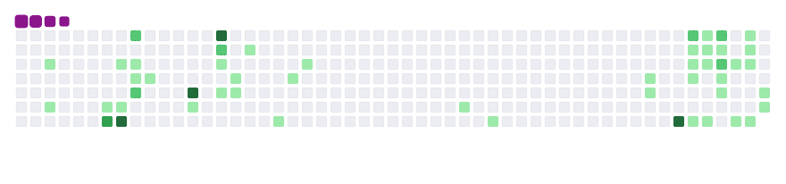

<!--  -->

<h1 align="center">Hi , I'm Ramanand Thakur</h1>
<h3 align="center">I'm a passionate AI/ML and Front-end Developer from Goa, India.</h3>

## 🙋‍♂️ About Me

- 🔭 I’m currently working on ****My Portfolio****

- 🌱 I’m currently learning ****Open Source****

- 👯 I’m looking to collaborate on ***on open source projects***

- 📫 How to reach me **ramanandt35@gmail.com**

- ⚡ Fun fact **Coding can “power up” your brain.**

## 🚀 Languages and Tools:

    
                    
 
    
    

     
<!-- 
 -->
 

    

    

## 📊 My Github Stats

 

 

 
 

     </b><b> <b> 
     Show some ❤️ by Following and Starring some of my repositories😊

 
 

 
 

## Connect with me:

## ❤ Views and Followers

 
 

<!--  -->

## 𝓢𝓾𝓹𝓹𝓸𝓻𝓽 𝓂𝑒:

<!--  -->

  
  
  

<h1 align='center'>⚡️𝓢𝓽𝓪𝔂 𝓐𝔀𝓮𝓼𝓸𝓶𝓮!⚡️</h1>